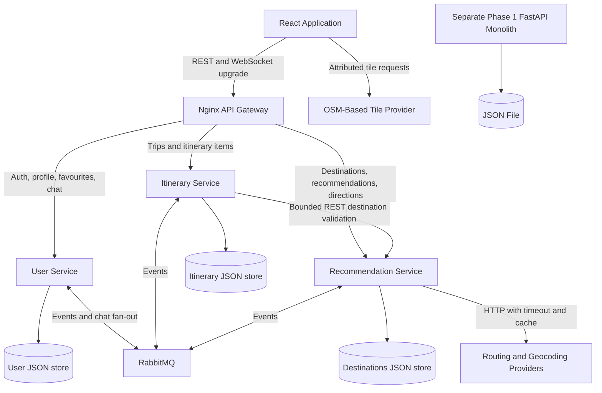

# GlobeTrotter Application Plan

## 1. Product Direction

Build a travel discovery and itinerary application with a React frontend and two clearly separated FastAPI backend implementations: an educational monolith for Phase 1 and independently deployable microservices for Phase 2. The finished frontend connects only to the microservices through an API gateway.

The initial destination catalogue will focus on Yaounde, Cameroon, based on the supplied image filenames. Confirm this geography and each pictured location before importing destination records. The data model will support additional cities and countries without redesigning the application.

The first screen is a usable Explore experience, not a marketing landing page. Users can discover places, inspect them on a map, get directions, create a trip, save favourites, edit their profile, and talk in a global traveller chat.

### Scope Decisions

- Preserve the assignment's three core services: User, Itinerary, and Recommendation. The Recommendation Service also owns the destination catalogue, as shown in the assignment architecture.
- Implement global chat as a module inside the User Service. It remains a separate ownership boundary in code and can become a fourth service later if connection volume requires it.
- Use REST for immediate requests, RabbitMQ for asynchronous cross-service events and live chat distribution, and WebSockets between the browser and User Service for chat.
- Run all components on one development machine or VM using Docker Compose. Kubernetes is outside the initial scope.
- Use real local destination assets and accurate destination information. Do not fabricate ratings, opening hours, prices, or travel times.

## 2. Feature Priorities

| Priority | Features | Completion Standard |
| --- | --- | --- |
| P0: Assignment foundation | Register, login, destination search, preference-based recommendations, create/list itineraries | Works in the Phase 1 monolith and has equivalent public contracts in Phase 2 |
| P0: Main experience | Explore, destination detail, profile, favourites, trip planner, map, driving directions, global chat | React uses the microservices gateway for all application data |
| P0: Operational baseline | Validation, authorization, seed data, health checks, Docker Compose, tests | A fresh checkout can be started using documented steps |
| P1: Trip quality | Drag-to-reorder stops, schedule warnings, private/public sharing, estimated budget, English/French interface | Core trip editing and ownership checks remain functional without these enhancements |
| P1: Community quality | Report messages, moderator hide/mute, unread marker, connection recovery indicator | Moderation actions are server-authorized and auditable |
| P1: Personalization | Explainable recommendation scores, recently viewed places, accessibility and travel-style filters | Preferences are editable; sensitive inferences are not made |
| P2: Optional extensions | Weather, opening-hours integration, calendar export, offline access to saved trip summaries, shared trip editing | Added only after the main release gates pass |

For the initial release, include basic chat reporting, moderator hide/mute, and rate limiting even if the rest of the community enhancements remain deferred. Exclude payments, real hotel bookings, turn-by-turn voice navigation, generative AI itinerary creation, and native mobile applications. Hotel and restaurant records are destinations; booking links, if added, lead to verified external sites.

## 3. Technology Choices

| Area | Choice | Reason |
| --- | --- | --- |
| Frontend | React, TypeScript, Vite | Component-based application with fast local iteration and a static production build |
| Navigation and server state | React Router, TanStack Query | Explicit routes, cached API data, mutations, and predictable loading/error handling |
| Forms and validation | React Hook Form, Zod | Accessible forms and typed input validation; backend validation remains authoritative |
| Styling and controls | Tailwind CSS, CSS design tokens, Radix UI primitives | Custom visual identity with accessible dialogs, menus, tabs, and controls |
| Icons and animation | Lucide React, Motion | Consistent tool icons and carefully scoped transitions |
| Maps | Leaflet, React Leaflet, OpenStreetMap-based tiles | Destination markers, route polylines, and interactive geographic browsing |
| Backend | FastAPI, Pydantic, Uvicorn | Typed REST contracts, OpenAPI, async I/O, and WebSocket support |
| Phase 1 persistence | JSON file | Matches the monolith assignment; no database |
| Phase 2 persistence | JSON file per service | Same JSON-file approach as the monolith, applied per service so each microservice still owns its own data with no shared storage |
| Messaging | RabbitMQ, aio-pika | Topic events, publisher confirmations, consumer acknowledgements, and live fan-out |
| External HTTP requests | HTTPX | Explicit timeouts and controlled provider access |
| Gateway and local deployment | Nginx, Docker Compose | Same-origin routing, WebSocket upgrades, and reproducible local infrastructure |
| Tests | pytest, Vitest, React Testing Library, Playwright | Backend behavior, frontend states, and complete user journeys |

Select maintained, mutually compatible versions at implementation time and commit dependency lockfiles. Keep frontend component state local by default; introduce a small UI store only if map/planner interactions genuinely need shared transient state. Do not duplicate TanStack Query's server cache in a global store.

## 4. Repository Structure

The following is the proposed structure, not an assertion that these files already exist:

```text
globetrotter/
  PROJECT_PLAN.md
  README.md
  .env.example
  destination images/               Original supplied assets, retained unchanged
  frontend/
    public/
    src/
      app/                          Router, providers, application shell
      components/ui/                Reusable accessible controls
      features/
        auth/
        explore/
        destinations/
        map/
        itineraries/
        profile/
        chat/
      lib/                          API client, generated types, utilities
      styles/                       Tokens, global styles, motion rules
      assets/                       Destination asset manifest
    tests/
    package.json
  backend/
    monolith/
      app/
        main.py
        api/                        Auth, users, destinations, recommendations, trips
        services/                   Business logic
        repositories/               JSON persistence and atomic writes
        schemas/
        core/                       Configuration, auth, error handling
      data/                         Seed JSON; runtime data is not committed
      static/destinations/          Generated destination images, served at /static
      tests/
      pyproject.toml
      Dockerfile
    microservice/
      gateway/
        nginx.conf
        Dockerfile
      user_service/
        app/
          api/
          services/
          repositories/
          schemas/
          core/
          chat/                     WebSocket manager, history, moderation
          messaging/                Outbox publisher and event consumers
        data/                       JSON data file (this service's own store)
        tests/
        pyproject.toml
        Dockerfile
      itinerary_service/
        app/                        Same API/service/repository layering
        data/                       JSON data file (this service's own store)
        tests/
        pyproject.toml
        Dockerfile
      recommendation_service/
        app/
          api/
          services/                 Catalogue, ranking, search
          repositories/
          schemas/
          core/
          providers/                Routing and geocoding adapters
          messaging/
        data/                       JSON data file (this service's own store)
        static/destinations/        Generated destination images, served at /static
        tests/
        pyproject.toml
        Dockerfile
      contracts/                    Versioned event schemas and API specifications
      tests/                        Cross-service integration and contract tests
  infra/
    compose.microservices.yml
    compose.monolith.yml
    rabbitmq/                       Exchanges, queues, development configuration
  scripts/                          Asset generation, seed, and validation commands
  docs/
    architecture.md
    api.md
    events.md
    setup.md
    testing.md
    demo-checklist.md
```

### Structure Rules

- Keep the exact sibling folder names `backend/monolith` and `backend/microservice`.
- Do not import monolith business logic or repositories into the microservices.
- Keep each service's dependencies, tests, JSON data store, and container independently runnable.
- Share wire-format specifications, not service internals or a common data-access layer.
- Keep secrets, generated runtime data files, uploads, and broker credentials out of Git.
- The default development environment starts the microservices. The monolith has a separate launch configuration for its own demonstration.

## 5. Backend Architecture



Only the gateway is public for application API access. The browser may request map tiles from the configured tile provider; it never connects directly to RabbitMQ, a service's JSON store, or an internal service port. Provider secrets remain on the backend. The frontend has no monolith fallback.

### Service Ownership

| Service | Responsibilities | Owned Data |
| --- | --- | --- |
| User | Registration, authentication, profile, travel preferences, favourites, chat history, message moderation | Users, preferences, refresh sessions, saved destination references, chat rooms/messages, reports, bans |
| Itinerary | Trip dates, ordered stops, notes, budgets, ownership, sharing | Itineraries, itinerary days/items, share tokens, local destination snapshots |
| Recommendation | Destination search/detail, categories, recommendation ranking, routing/geocoding adapters | Destinations, categories, asset metadata, recommendation projections, provider cache |

Use three separate JSON data files (one per service, following the same approach as the Phase 1 monolith -- see PROJECT_PLAN.md section 6). Each service is the only reader/writer of its own file; no cross-service reads, joins, or shared storage. The same limitations documented for the monolith apply here too: no real transactions, no indexing, no multi-process safety -- each service runs as a single worker process guarded by an in-process lock.

### Core Data Shapes

- `User`: ID, email, password hash, display name, bio, avatar reference, home city, locale, timestamps.
- `UserPreferences`: interests, budget band, preferred pace, accessibility needs, optional starting area.
- `Destination`: stable ID, slug, name, category, city/country, coordinates, description, image manifest key, tags, optional hours/cost/accessibility details and provenance.
- `Itinerary`: ID, owner ID, title, start/end dates, visibility, currency, revision, timestamps.
- `ItineraryItem`: itinerary ID, destination ID, day, position, scheduled time, duration, notes, estimated cost, destination snapshot.
- `ChatMessage`: ID, room ID, room sequence, sender ID, client message ID, text, timestamps, moderation state.
- `OutboxEvent` and `ProcessedEvent`: local records used for reliable publishing and idempotent consuming.

Store money as decimal amounts with a currency code, not floating point. Support XAF display for the initial Cameroon catalogue. Store instants in UTC and display destination-local schedules using an IANA time zone such as `Africa/Douala` after geography is confirmed. Keep date-only itinerary dates as dates.

## 6. Phase 1: Monolith Deliverable

Implement a single FastAPI application backed by a JSON file, preserving the assignment's limitations for comparison.

| Method | Endpoint | Behavior |
| --- | --- | --- |
| POST | `/register` | Create a user |
| POST | `/login` | Authenticate and establish a session |
| GET | `/destinations` | Search/filter destinations |
| GET | `/recommendations` | Return preference-based suggestions |
| POST | `/itineraries` | Create an owned itinerary |
| GET | `/itineraries` | List the authenticated user's itineraries |

Keep these assignment-facing routes available in the monolith. The microservices use the versioned equivalent paths described below. Auth, ownership checks, password hashing, validation, and stable IDs apply in both implementations.

Use a repository abstraction for JSON reads/writes, an in-process write lock, and temporary-file replacement to prevent partial file writes. Explicitly run one application worker: these safeguards do not turn JSON into a concurrent multi-process database. Document the lack of transactions, indexing, horizontal scaling, and fault isolation.

Phase 1 acceptance: the six endpoints pass behavior tests, data survives restart, another user cannot read or modify a private trip, and the application can be demonstrated through OpenAPI without a separate monolith frontend.

## 7. Phase 2: Microservices and API Gateway

### Public REST Surface

| Owner | Endpoint Group | Main Operations |
| --- | --- | --- |
| User | `/api/v1/auth` | Register, login, logout, refresh, CSRF token |
| User | `/api/v1/users/me` | Read/update profile, preferences, avatar, favourites, personal trip statistics |
| Recommendation | `/api/v1/destinations` | Paginated search, categories, destination detail |
| Recommendation | `/api/v1/recommendations` | Personalized suggestions with short reason labels |
| Recommendation | `/api/v1/directions` | Route between a start and one or more destination stops |
| Recommendation | `/api/v1/geocoding` | Validated place search through the configured provider |
| Itinerary | `/api/v1/itineraries` | Create/list/read/update/delete trips; manage ordered items |
| Itinerary | `/api/v1/itineraries/{id}/share` | Create/revoke an optional read-only share link |
| User | `/api/v1/chat/messages` | Cursor-paginated history, reporting, authorized moderation |
| User | `/ws/chat` | Authenticated bidirectional global chat |

Specific subpaths and request/response schemas will be specified in OpenAPI before the frontend integration starts. Generate frontend API types from those contracts. Standardize validation errors, unauthorized/forbidden responses, pagination, UTC timestamps, and request IDs. Use anonymous Explore access with a non-personalized recommendations fallback; require login for persistent favourites, private trips, profile edits, and chat participation.

### Synchronous Communication

- Itinerary creation validates destination references through an internal, batch-capable Recommendation API with a short timeout. Existing trips remain readable from their own stored snapshots if that service is unavailable.
- Each service verifies User Service-signed short-lived JWTs locally using public keys. The User Service retains the private signing key; consumers cache public keys with an explicit rotation policy.
- Protect internal-only APIs with service credentials or network identity in addition to network isolation. Do not treat a Docker network as authorization.
- Use bounded retries only for safe/idempotent operations. Show partial-failure states instead of turning a missing recommendation into a full-page failure.

### RabbitMQ Event Design

Use a durable topic exchange for domain events, durable service-specific queues, persistent messages, publisher confirms, explicit consumer acknowledgements, bounded retries, and dead-letter queues.

| Event | Producer | Consumer and Purpose |
| --- | --- | --- |
| `user.preferences.updated.v1` | User | Recommendation updates its local preference projection |
| `user.favourite.changed.v1` | User | Recommendation updates interest signals |
| `itinerary.created.v1` | Itinerary | User updates profile trip statistics |
| `itinerary.deleted.v1` | Itinerary | User updates profile trip statistics |
| `destination.updated.v1` | Recommendation | Itinerary refreshes display snapshots without rewriting user schedules |
| `chat.message.created.v1` | User | All active User Service WebSocket instances broadcast a persisted message |
| `chat.message.hidden.v1` | User | All active WebSocket instances remove moderated content from view |

Every envelope contains an event ID, event type/version, occurrence time, producer, aggregate ID/version, correlation ID, and payload. Do not include passwords, refresh tokens, or unnecessary profile data.

Write domain changes and outbox records in the same JSON store write (see section 6's repository-abstraction approach, reused per microservice). A separately runnable publisher worker sends outbox events using RabbitMQ publisher confirms. Consumers deduplicate by event ID and apply domain changes before acknowledging. Use aggregate versions to reject stale projection updates. Treat delivery as at-least-once, not exactly-once.

Chat live events use a separate fan-out exchange with one temporary queue per active WebSocket process. The User Service's JSON store holds the durable chat history; offline clients recover through history instead of retaining one broker queue per browser. Broker outages must not lose committed chat messages: persist the message/outbox first, show a delivery state, and broadcast once the broker recovers.

Worker processes are deployment roles of their owning service, not additional business services. Include a replay/rebuild command for recommendation and profile projections, plus a demonstration of pending outbox recovery and dead-letter inspection.

## 8. Frontend Screens and Navigation

Desktop: a compact left navigation rail, a functional top search/filter bar, and a generous main workspace. Mobile: bottom navigation for Explore, Map, Trips, Chat, and Profile, with safe-area padding and a scrollable main view. Authentication opens a focused screen or accessible dialog without losing the user's current destination.

| Screen | Layout and Key Interactions |
| --- | --- |
| Explore | Destination photographs, compact city heading, search, category filters, saved toggle, recommendation row, grid/map view switch |
| Destination Detail | Prominent real image, description, verified practical details, location preview, save, add-to-trip, and directions actions |
| Map | Large map surface, category filters, selectable markers, route summary, desktop result rail, mobile result bottom sheet |
| Trip Planner | Trip header, day tabs, ordered stops, timings/budget, add-stop search, synchronized route preview |
| My Trips | Upcoming/past trip views, create/edit/delete, destination image covers, optional sharing status |
| Profile | Avatar, display name, bio, home city, preferences, favourites, trip statistics, account settings |
| Global Chat | Message history, sender avatars, connection state, unread marker, composer, reporting menu |
| Authentication | Register/login forms, clear validation and session-expiry recovery |

All data screens need skeleton/loading, empty, success, error, retry, and unauthenticated states where applicable. Handle expired sessions without losing unsent chat text or an unsaved itinerary draft. Keep saved drafts limited to non-sensitive content and clear account-specific caches/drafts on logout or account switch.

### Useful Additional Features

- Explain recommendations with labels such as "Matches your nature interests" rather than an unexplained score.
- Warn when itinerary stop times overlap; only warn about opening hours when that information is available.
- Use explicit move-up/move-down actions as an accessible alternative to dragging itinerary stops.
- Provide read-only sharing with a revocable, unguessable token; public pages omit private notes and user contact details.
- Show budget totals by day and trip, clearly distinguishing user estimates from actual entry prices.
- Offer an explicit "Visited" action later; do not infer a visit from GPS access or a destination-page click.
- Export an itinerary summary or calendar after the primary planner works; offline trip summaries must not imply offline maps or live routing.

## 9. Visual Identity and Motion

### Design Direction: Colourful Travel Atlas

Use bright travel photography, clean map surfaces, expressive headings, and a restrained set of high-energy accents. The app should feel lively while keeping trip editing and directions easy to scan. Avoid oversized promotional heroes, nested cards, and decorative elements competing with map labels.

| Token | Colour | Purpose |
| --- | --- | --- |
| Canvas | `#F6F8FA` | Cool, light application background |
| Surface | `#FFFFFF` | Controls, sheets, repeated destination cards |
| Ink | `#182321` | Main text and navigation |
| Primary | `#087F6D` | Primary travel actions and selected states |
| Coral | `#F26B5B` | Selective highlights and community accents |
| Mango | `#FFB547` | Small highlights, selected itinerary moments |
| Route Blue | `#3D66DB` | Route lines and map-related actions |
| Border | `#DCE3E4` | Quiet separation and form boundaries |

Use Sora for headings and Manrope for interface/body text, self-hosted with the necessary font licenses. Keep letter spacing at zero and use fixed/rem-based type scales rather than viewport-scaled text. Verify actual colour pairings for WCAG AA; use dark text on coral/mango surfaces and never communicate state through colour alone.

### Component Rules

- Destination cards may have a maximum 8px corner radius; page sections remain unframed.
- Keep image slots at stable aspect ratios and reserve dimensions before loading.
- Use Lucide icons for save, directions, filtering, send, edit, and map tools, with accessible names and tooltips where needed.
- Use tabs for days/views, segmented controls for grid/map modes, checkboxes for multi-category filters, and switches for binary settings.
- Keep mobile targets at least 44px high and make map sheets, chat composers, and dialogs work with the software keyboard.
- Display real imagery clearly without heavy darkness, blur, or decorative cropping that obscures the place.

### Animation Plan

- Stagger destination-card entry by a small amount; keep the whole reveal brief and avoid reanimating all results after every filter change.
- Use 150-250ms transitions for tabs, drawers, save feedback, and selection changes.
- Animate route drawing when a new route arrives; do not continuously pulse every map marker.
- Use a lightweight, slowly moving geographic contour/dotted-path background in limited non-map areas, with pointer events disabled and no content obscured. Avoid glowing orbs or busy full-screen particles.
- Use subtle image movement on hover only when it does not compromise image clarity or layout stability.
- Respect `prefers-reduced-motion`, offer a motion setting, pause ambient motion in hidden tabs, and avoid autoplaying background video.

Verify 360px, 390px, 768px, 1440px, and wide-desktop layouts. Check long names, translated labels, 200% zoom, narrow chat bubbles, and sticky controls for clipping or overlap.

## 10. Destination Images and Seed Data

Retain the original folder as the source of truth for raw assets. Generate appropriately sized WebP/AVIF variants during a dedicated asset-build step and write them into each backend's own `static/destinations/` folder (monolith and Recommendation Service each get their own copy, mounted at `/static`), not into the frontend build. Each destination record's `image` field carries root-relative paths such as `/static/destinations/<slug>-960.webp`, alt text, and dimensions; the frontend resolves them against whichever backend base URL it is configured against. Do not derive runtime paths by guessing filenames: the supplied names contain apostrophes, underscores, and mixed case.

These are the 13 supplied assets and the display names/categories used to seed the catalogue.

| Source Asset | Display Name | Category |
| --- | --- | --- |
| [destination images/basilica.png](destination%20images/basilica.png) | Basilica | Heritage |
| [destination images/bois_d'ebene.jpg](destination%20images/bois_d'ebene.jpg) | Bois d'Ebene | Nature |
| [destination images/bois_saint_anastasie.jpg](destination%20images/bois_saint_anastasie.jpg) | Bois Saint Anastasie | Nature |
| [destination images/cathedrale_notre_dame_des_victoires.jpg](destination%20images/cathedrale_notre_dame_des_victoires.jpg) | Cathedrale Notre-Dame des Victoires | Heritage |
| [destination images/club_de_golf_yaounde.jpg](destination%20images/club_de_golf_yaounde.jpg) | Club de Golf Yaounde | Recreation |
| [destination images/hilton_hotel.jpg](destination%20images/hilton_hotel.jpg) | Hilton Hotel | Stay |
| [destination images/hotel_la_falaise.jpg](destination%20images/hotel_la_falaise.jpg) | Hotel La Falaise | Stay |
| [destination images/l'hybride_restaurant.jpg](destination%20images/l'hybride_restaurant.jpg) | L'Hybride Restaurant | Food |
| [destination images/Lac_Municipal.jpg](destination%20images/Lac_Municipal.jpg) | Lac Municipal | Nature |
| [destination images/le_safoutier.jpg](destination%20images/le_safoutier.jpg) | Le Safoutier | Food |
| [destination images/reunification_monument.png](destination%20images/reunification_monument.png) | Reunification Monument | Heritage |
| [destination images/Stade_Paul_Biya.jpg](destination%20images/Stade_Paul_Biya.jpg) | Stade Paul Biya | Sport |
| [destination images/statue_de_charles_atangana.jpg](destination%20images/statue_de_charles_atangana.jpg) | Statue de Charles Atangana | Heritage |

Before seeding, inspect each image for subject match and usable resolution; confirm place name, coordinates, category, source/usage permission, and any required credit. Do not assume supplied files are licensed for public redistribution.

Use responsive image sources, lazy-load below-the-fold imagery, prioritize only the main visible image, and provide a graceful missing-image state. Verify original and generated image URLs on a case-sensitive Linux container, not only on Windows.

## 11. OpenStreetMap, Routes, and Directions

OpenStreetMap supplies geographic data; map tiles and road routing are separate capabilities. A line between coordinates is not a usable road route.

### Initial Routing Choice

Use React Leaflet for rendering, an OSM-based tile provider with visible attribution, and a backend OSRM adapter for driving directions. For a dependable local demonstration, provide an optional self-hosted OSRM Compose profile using a prepared regional road dataset. Document dataset download/preprocessing, disk/memory needs, and the one-time setup separately. Do not present a public demo routing endpoint as a production dependency.

If walking or cycling is required, enable a provider/profile that actually supports it, such as an appropriately configured openrouteservice or GraphHopper adapter. Hide unsupported travel modes; never relabel a driving route as a walking route.

### Directions Flow

1. User opens any destination and selects Directions.
2. User chooses their current location, a searched address, a map point, or a previous itinerary stop as the start.
3. Ask for browser geolocation only after the explicit location action. Provide manual input if permission is denied or location is unavailable.
4. The backend validates coordinates, travel mode, stop count, and provider limits, then returns route geometry, distance, duration estimate, and maneuvers.
5. The map fits the route, displays start/end markers, and exposes a readable step-by-step directions panel.
6. The planner requests routes through the user's ordered stops. Warn when provider waypoint limits are reached; do not silently drop stops.
7. On timeout or no-route results, retain the destination map and show a clear retry/change-start state. Do not invent travel times or call a straight line a route.

Cache routes only within provider terms and a defined retention period. Avoid logging precise user origins. Do not persist a user's live location unless they explicitly save a starting point to a trip.

### Provider Constraints

- Keep OpenStreetMap and tile-provider attribution visible, including when sheets are open.
- Select a tile provider whose published usage limits fit the deployment. Do not bulk-download public OSM tiles or promise offline maps using those endpoints.
- If using public Nominatim, comply with its current identification, attribution, caching, and rate-limit policy; do not implement client-side autocomplete against it. Prefer a provider that permits autocomplete when that feature is enabled.
- Proxy routing/geocoding requests with secrets through the backend. Allowlist provider hosts and enforce timeouts, payload limits, and request quotas.
- Validate routing coverage and at least three representative local routes early. Provider choice remains an implementation gate until these checks pass.

## 12. Global Chat with WebSockets

### User Experience

Start with one global room. Include paginated history, avatars/display names, timestamps, a text composer, send/pending/failed states, an unread separator, retry, and clear reconnect feedback. Keep scrolling stable when older messages load and do not force users to the bottom while they read history. Limit the first release to plain text; attachments and direct messages are deferred.

### Connection and Delivery

- Connect to same-origin `/ws/chat` through the gateway with WebSocket upgrade headers and suitable idle timeout settings.
- Authenticate the connection using the secure session cookie and validate the `Origin` header against an explicit allowlist.
- Support typed, versioned messages such as `chat.send`, `chat.ack`, `chat.created`, `chat.hidden`, `ping`, `pong`, and `error`.
- Accept a client-generated message ID and enforce uniqueness per sender so reconnect retries do not create duplicate messages.
- Allocate a monotonically increasing sequence per room within the persistence transaction. Acknowledge durable storage separately from broadcast receipt; an acknowledgement does not mean every recipient has read the message.
- Persist first, then fan out through RabbitMQ to all User Service instances. Clients deduplicate and order messages by server sequence.
- After reconnect or a detected sequence gap, fetch history after the last received sequence. Hidden records retain tombstones so cursor recovery remains consistent.
- Use capped exponential backoff with jitter, heartbeats, bounded outgoing buffers, and disconnection of persistently slow clients.
- Close or reauthenticate a connection when its session expires. Logout and moderator bans must revoke active connections through server-side session checks or invalidation events.

### Safety and Privacy

Validate payloads, cap text length, rate-limit sends and connection attempts, and render text without accepting raw HTML. Enforce mute/ban decisions on the server. Provide message reporting, authorized hide actions, and an audit trail. Do not expose email addresses, tokens, exact locations, or private profile fields in chat events. Presence and typing indicators can follow later; do not invent an online count from a single instance's connection list.

## 13. Security, Reliability, and Operations

- Hash passwords using Argon2id; enforce unique normalized email addresses and rate-limit authentication.
- Use short-lived access JWTs and rotated refresh tokens stored hashed server-side. Prefer HttpOnly, Secure, SameSite cookies; do not store long-lived credentials in browser local storage.
- Protect cookie-authenticated state-changing HTTP requests with CSRF tokens and Origin checks. SameSite alone is not the full CSRF strategy.
- Apply owner checks on every private itinerary and profile operation, including nested items and share management.
- Use exact CORS origins for development, HTTPS/WSS outside localhost, and a same-origin gateway in production.
- Support avatar replacement with validated image decoding, content/size limits, generated filenames, metadata stripping, and separate upload storage. Do not fetch arbitrary avatar URLs from the backend.
- Keep each service's JSON data file and the RabbitMQ management UI private (not internet-facing). Add input limits, structured errors, and safe logging.
- Include liveness and readiness endpoints, correlation IDs across REST/events, structured logs, and basic latency/error metrics.
- Publish dependency health separately from liveness. A broker outage should delay events without killing otherwise healthy API processes.
- Back up each service's JSON data file and uploads; perform one documented restore rehearsal before deployment. A durable broker queue is not a backup.
- Use deterministic seed data; never reset live data during application startup.
- Document data retention for chat, profiles, logs, and cached routes. Do not offer account deletion until cross-service cleanup and chat anonymization behavior is implemented and tested.

## 14. Implementation Roadmap

Indicative effort for one developer is 26-41 working days, assuming full-time work and no major provider or deployment blockers. This is a planning estimate, not a delivery guarantee. Complete and validate each vertical slice before expanding to optional features.

| Milestone | Estimate | Work | Exit Gate |
| --- | --- | --- | --- |
| 0. Validate foundation | 2-3 days | Inspect assets, verify seed locations, test map/routing coverage, agree API/event contracts, establish tokens and repository skeleton | Verified asset manifest, viable route provider, architecture decisions recorded |
| 1. Phase 1 monolith | 2-3 days | JSON repository, authentication, destinations, recommendations, itinerary endpoints | Six assignment endpoints tested and restart persistence demonstrated |
| 2. Microservices infrastructure | 3-5 days | Gateway, three FastAPI services, owned JSON data stores, RabbitMQ, outbox workers, Compose | Independently healthy services; one durable event passes end to end |
| 3. Auth, profile, Explore | 5-7 days | React shell, design system, sessions, profile editing, seed catalogue, filters, detail, favourites | First complete browser journey against real microservices |
| 4. Planner, map, recommendations | 5-8 days | Trip CRUD, stop order/days, routing panel, preferences, event-driven projections | User builds and reloads a real routed trip; recommendation reasons render |
| 5. Global chat | 3-5 days | Persisted history, WebSockets, RabbitMQ fan-out, recovery, minimum moderation | Two browser sessions exchange messages; two service instances fan out correctly |
| 6. Visual and UX finish | 3-5 days | Ambient animation, responsive polish, reduced motion, errors/empty states, selected P1 features | Desktop/mobile visual checks, keyboard navigation, no clipping or overlap |
| 7. Release and presentation | 3-5 days | Integration/security tests, load checks, deployment, backup restore, docs, phase comparison | Reproducible setup and all required demo scenarios pass |

If time is constrained, defer sharing, budget enhancements, translations, weather, and collaborative editing. Keep the required profile, WebSocket global chat, real directions, original images, and separate backend implementations.

## 15. Test and Acceptance Strategy

### Focused Automated Checks

| Layer | Checks |
| --- | --- |
| Monolith | Registration/login, JSON persistence, invalid data, destination search, private-trip ownership |
| Each microservice | Validation, authentication, ownership, ranking rules, repository behavior, startup from an empty JSON store |
| Contracts | OpenAPI-generated frontend types and versioned RabbitMQ payload compatibility |
| Messaging | Duplicate delivery, retry limit, dead-letter routing, broker outage, outbox recovery, stale projection updates |
| Directions | Valid routes, invalid coordinates, no route, timeout, unsupported mode, waypoint limit; deterministic provider stubs plus a live smoke test |
| Chat | Unauthorized/bad-Origin rejection, length/rate limits, persistence, retry deduplication, reconnect recovery, moderation, multi-instance fan-out |
| Frontend | Form errors, loading/empty/error states, route summary, filter state, itinerary editing, logout cache cleanup |
| Browser E2E | Register -> preferences -> Explore -> destination -> save -> itinerary -> directions -> profile -> global chat |

### Visual and Performance Gates

- Capture Playwright screenshots on desktop and mobile, including the map, route panel, profile, trip planner, and chat with the mobile keyboard layout considered.
- Verify map tiles, markers, route geometry, and all 13 destination image mappings render; test provider failure separately from UI rendering.
- Check keyboard-only flows, visible focus, accessible names, contrast, reduced motion, and screen-reader announcements for errors/new chat messages.
- Check no horizontal overflow, overlapping controls, unstable image/card dimensions, or unreadable long destination names.
- Target an LCP of 2.5 seconds or better and CLS below 0.1 on representative production-build Explore tests; record device/network conditions rather than claiming universal results.
- Run a documented initial load check with 50 concurrent chat clients and a modest 20-message/second aggregate burst. Measure errors, ordering, and latency on the actual VM before setting capacity promises.

### Required Demonstration

1. Show the monolith running independently with JSON persistence and its assignment endpoints.
2. Start the microservices stack and show React using only the gateway API.
3. Register, edit a profile/preferences, browse actual destination images, and save a favourite.
4. Create an itinerary, add/reorder destinations, reload it, and obtain a road route with directions.
5. Show preference updates reaching Recommendation through RabbitMQ and changing explainable results.
6. Open two authenticated browser sessions, exchange chat messages, reconnect, and recover history.
7. Run two User Service instances and demonstrate RabbitMQ-backed chat fan-out.
8. Stop RabbitMQ briefly: show committed writes retained in the outbox and recovery without duplicate effects.
9. Stop Recommendation: show profile, chat, and existing trip reading remain available with honest partial-failure states.
10. Demonstrate desktop/mobile layouts, reduced-motion behavior, and private-trip authorization denial.

## 16. Deliverables and Definition of Done

- A Phase 1 FastAPI monolith in its own folder, using JSON storage and at least the six specified endpoints.
- Three independently runnable Phase 2 FastAPI services with owned JSON data stores, an API gateway, RabbitMQ events, and documented contracts.
- A React frontend connected to the microservices, with Explore, destination detail, map/directions, itinerary planning, profile, favourites, and global WebSocket chat.
- All supplied destination images mapped explicitly, optimized for display, and verified for the seed catalogue.
- A distinctive, colourful, responsive interface with accessible interactions and optional background motion.
- Separate monolith and microservices Compose configurations, environment templates, seeds, tests, and repeatable setup instructions for Windows/Docker Desktop and Linux deployment.
- A short architecture comparison explaining where the monolith is simpler and where microservices add deployment independence, failure isolation, eventual consistency, and operational complexity.

The immediate implementation step is Milestone 0: validate the 13 assets and destination records, prove one real road route with the chosen provider, then scaffold the separated repository and one end-to-end microservices-backed screen. This document is the plan only; it does not claim that application code, infrastructure, or tests have been implemented.